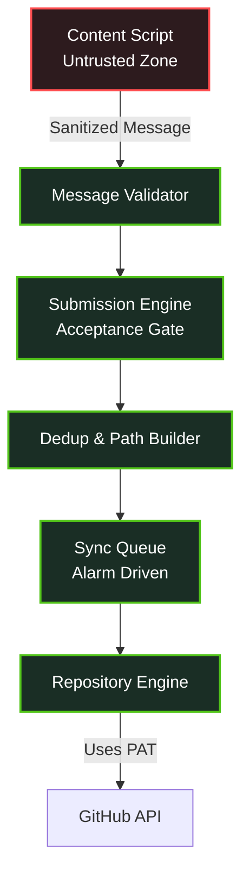

<div align="center">
  
  <h1>Codexa</h1>
  <p>Auto-sync competitive programming submissions to GitHub, seamlessly.</p>

  
  
  
  
</div>

<br/>

## Overview
**Codexa** is a modern, security-first Chrome Extension that automatically tracks your accepted solutions on competitive programming platforms (like LeetCode) and syncs them directly to your GitHub repository.

## Purpose
Why build Codexa? 
- **Zero Friction:** No manual copying and pasting code. Focus solely on problem-solving.
- **Build a Portfolio:** Automatically maintain a green GitHub contribution graph and a neatly organized repository of your algorithmic skills.
- **Trustworthy & Secure:** Traditional extensions ask for full GitHub access or route your code through third-party servers. Codexa runs entirely locally in your browser.

## Tech Stack & Why We Chose It

| Technology | Purpose | Why? |
|------------|---------|------|
| **React** | UI Framework | Component-based, fast, and excellent for building the popup interface. |
| **TypeScript** | Language | Type safety prevents runtime errors and improves code maintainability. |
| **Vite** | Build Tool | Extremely fast HMR and optimized bundling via `@crxjs/vite-plugin`. |
| **Manifest V3** | Extension API | Modern, secure, and performant extension architecture. |

## Features
- **Instant Auto-Sync:** Detects "Accepted" submissions in real-time without refreshing.
- **Local-First Architecture:** Your token and code never leave your browser (except directly to GitHub's API).
- **Smart Deduplication:** Prevents duplicate commits using SHA-256 hashing of your code.
- **Privacy Maintained:** Simple and secure GitHub authentication using Fine-grained Personal Access Tokens directly in the extension. No external OAuth apps.

## System Architecture



## Setup & Installation

1. **Clone the repository:**
   ```bash
   git clone https://github.com/yourusername/codexa.git
   cd codexa
   ```
2. **Install dependencies:**
   ```bash
   npm install
   ```
3. **Build the extension:**
   ```bash
   npm run build
   ```
4. **Load into Chrome:**
   - Go to `chrome://extensions/`
   - Enable **Developer mode** in the top right.
   - Click **Load unpacked** and select the `dist/` directory generated from the build.
5. **Connect:**
   - Click the extension icon in your toolbar.
   - Paste your GitHub repo URL and a Personal Access Token (PAT).
   - Solve a problem on LeetCode and watch it sync!

### How to get a GitHub Personal Access Token (PAT)
1. Go to your GitHub account and navigate to **Settings** > **Developer settings** (at the very bottom).
2. Click on **Personal access tokens** > **Tokens (classic)**.
3. Click **Generate new token (classic)**.
4. Give it a note (e.g., "Codexa Extension").
5. Under **Select scopes**, check the box for **`repo`** (Full control of private repositories). 
6. Scroll down, click **Generate token**, and copy the token (starts with `ghp_...`). Paste this directly into the Codexa extension!
